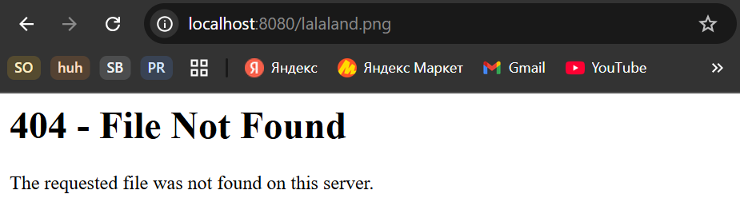
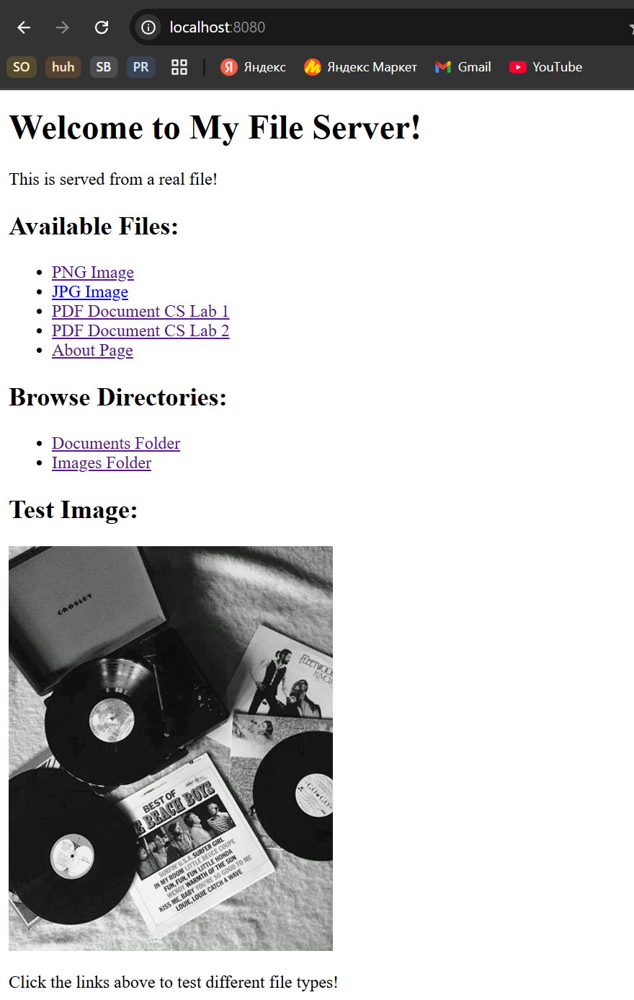
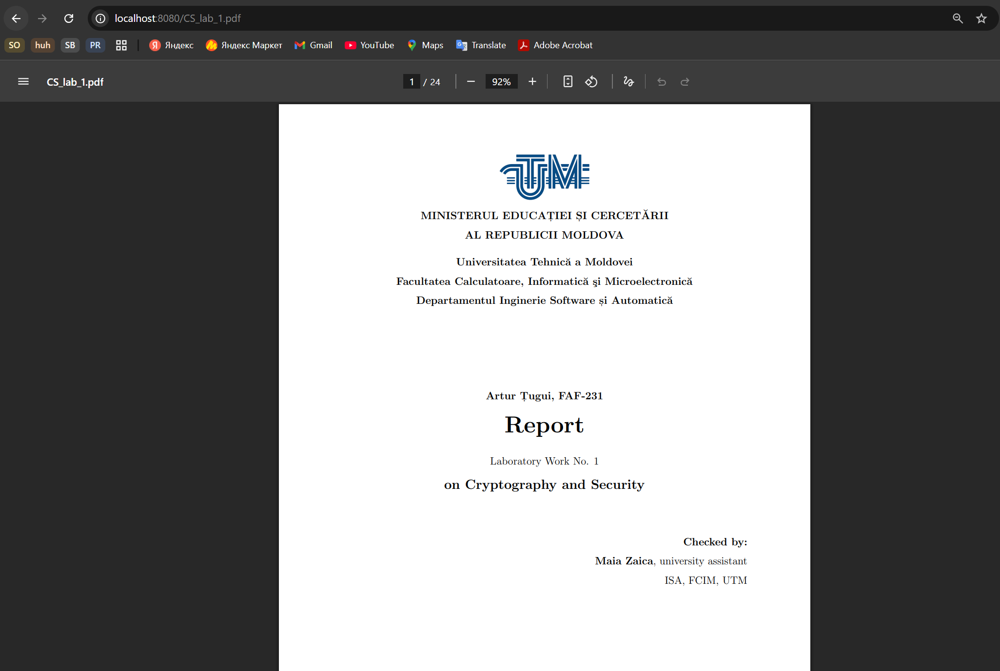
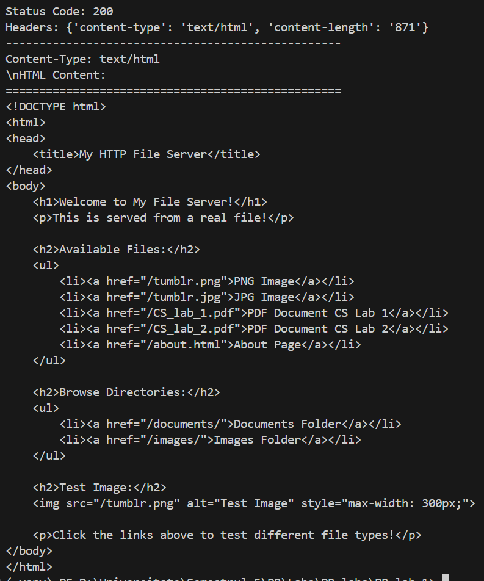
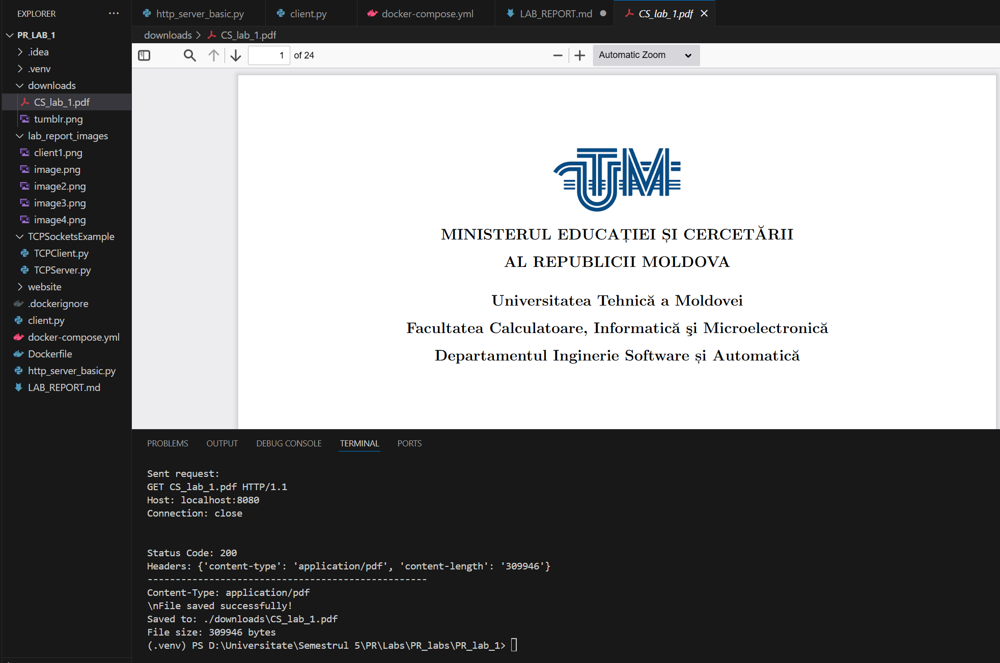
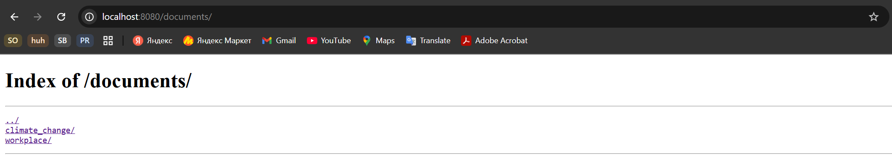
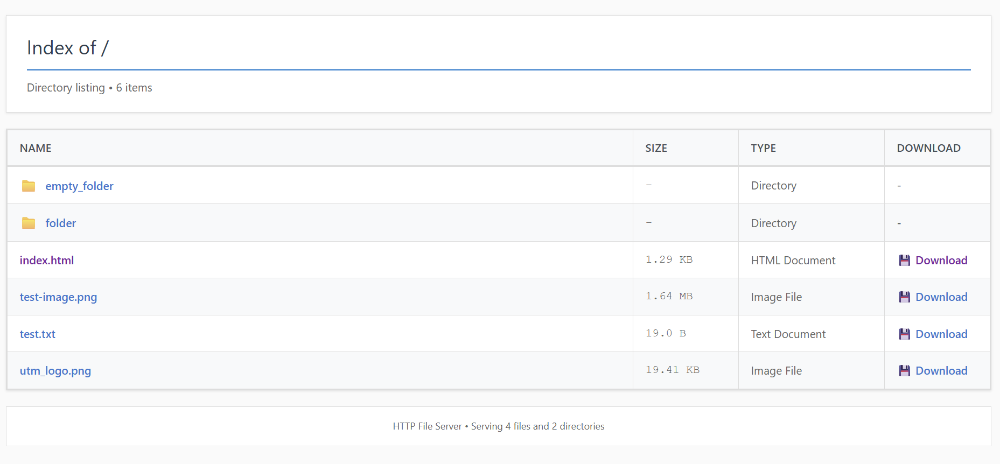

# Laboratory Work No. 1 Report: HTTP File Server with TCP Sockets

**Course:** Programare în Rețea

**Author:** Țugui Artur, FAF-231

---

## 1. Directory Contents

### 1.1 Source Directory Contents:

```
PR_lab_1/
├── http_server_basic.py       # HTTP server implementation
├── client.py                  # HTTP client implementation
├── website/                  # Served content directory
├── downloads/               # Client download directory
├── Dockerfile                 # Docker container definition
├── docker-compose.yml        # Docker Compose configuration
└──  .dockerignore             # Docker ignore file
```

### 1.2 Served Directory Contents:

```
PR_lab_1/
├── website/                  # Served content directory
│   ├── index.html           # Main HTML page
│   ├── about.html           # Secondary HTML page
│   ├── CS_lab_1.pdf         # PDF document 1
│   ├── CS_lab_2.pdf         # PDF document 2
│   ├── Tumblr.png           # PNG image file
│   ├── Tumblr.jpg           # JPG image file
│   ├── documents/           # Subdirectory with files
│   │   └── climate_change/
│   │       └── report-pages.png
│   │   └── workplace/
│   │       └── manual-pages.png
│   └── images/              # Subdirectory with images
│       └── food/
│           ├── photo1.png
│           └── photo2.png
```

---

## 2. Docker Configuration

### 2.1 Dockerfile:

```dockerfile
# Use Python 3.11 slim image as base
FROM python:3.11-slim

# Set working directory inside container
WORKDIR /app

# Copy the server and client scripts
COPY http_server_basic.py .
COPY client.py .

# Copy the website content
COPY website/ ./website/

# Create downloads directory
RUN mkdir -p downloads

# Expose port 8080 for the HTTP server
EXPOSE 8080

# Set default command to run the server
CMD ["python", "http_server_basic.py", "./website"]
```

### 2.2 Docker Compose File:

```yaml
services:
  http-server:
    build: .
    container_name: pr_lab1_http_server
    ports:
      - "8080:8080"
    volumes:
      # Mount website directory for easy content updates
      - ./website:/app/website:ro
      # Mount downloads directory for client testing
      - ./downloads:/app/downloads
    environment:
      - PYTHONUNBUFFERED=1
    restart: unless-stopped

  # Optional: Client service for testing
  http-client:
    build: .
    container_name: pr_lab1_http_client
    depends_on:
      - http-server
    volumes:
      - ./downloads:/app/downloads
    # Override default command to run client instead of server
    command: tail -f /dev/null # Keep container running for manual client testing
    profiles:
      - client # Only start when explicitly requested
```

---

## 3. Container Startup

```bash
# Start Docker containers
docker-compose up -d

# Start client container
docker-compose --profile client up -d

# Download files
docker-compose exec http-client python client.py http-server 8080 /index.html ./downloads

docker-compose exec http-client python client.py http-server 8080 tumblr.png ./downloads
```

---

## 4. Browser Testing - 4 File Types

### 4.1 Nonexistent File (404 Error)

**Request:** `http://localhost:8080/lalaland.png`

**Response:**



### 4.2 HTML File

**Request:** `http://localhost:8080/index.html`

**Result:**



### 4.3 PDF File

**Request:** `http://localhost:8080/CS_lab_1.pdf`

**Result:**


### 4.4 PNG Image File

**Request:** `http://localhost:8080/tumblr.png`

**Result:**


---

## 5. HTTP Client Results

### 5.1 HTML File (prints content):

```bash
python client.py localhost 8080 index.html ./downloads
```



### 5.2 PDF File (saves to directory):

```bash
python client.py localhost 8080 index.html ./downloads
```



---

## 6. Directory Listing Feature

**Request:** `http://localhost:8080/documents/`

**Response:**



---

## 7 Friend's Server Testing:

To connect to my friend's server I connected my laptop to his hotspot, entered a browser and accessed [http://192.168.1.4:8080/].



I also used my client to make a request to their server.

```bash
python client.py 192.168.1.4 8080 image.png ./downloads
```

And this image appeared in my downloads folder.


