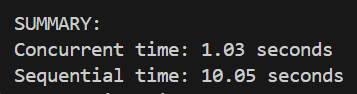
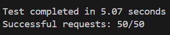
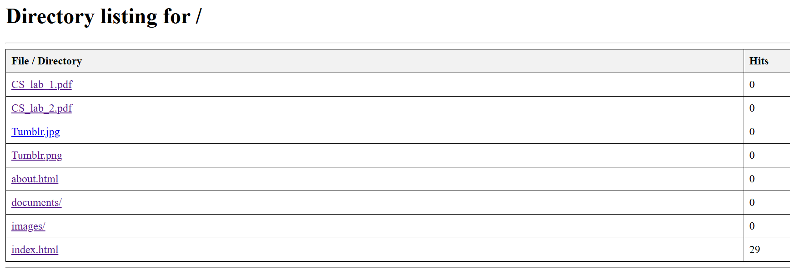
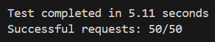
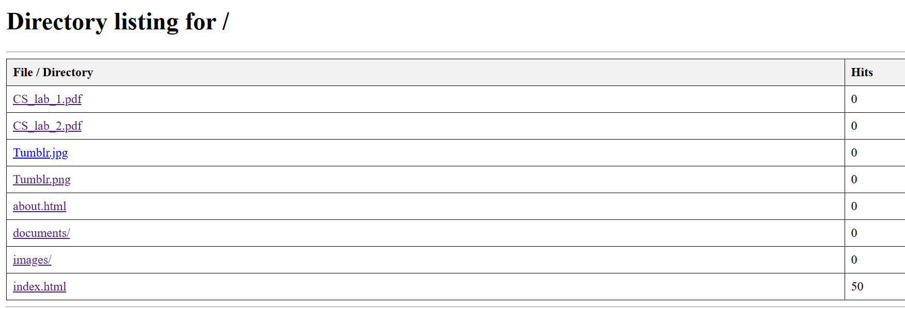

# Laboratory Work No. 2 Report: Concurrent HTTP server

**Course:** Programare în Rețea

**Author:** Țugui Artur, FAF-231

---

## 1. Directory Contents

### 1.1 Source Directory Contents:

```
PR_lab_1/
├── http_server_basic.py       # Multithreaded HTTP server implementation
├── test_performance.py        # Performance test (threading benefit)
├── test_race_condition.py     # Race condition demonstration
├── test_rate_limiting.py      # Rate limiting test
├── website/                   # Served content directory
├── templates/                 # HTML error templates
├── downloads/                 # Download directory
├── Dockerfile                 # Docker container definition
├── docker-compose.yml         # Docker Compose configuration
└── .dockerignore              # Docker ignore file
```

### 1.2 Key Features Implemented:

- **Multithreading**: ThreadPoolExecutor with 10 workers for concurrent request handling
- **Hit Counter**: Tracks file access counts with thread-safe implementation
- **Rate Limiting**: Sliding window algorithm (5 requests/second per IP)
- **Concurrency Control**: Thread locks to prevent race conditions
- **Error Handling**: Custom 404 and 429 (Too Many Requests) responses

---

## 2. Docker Configuration

### 2.1 Dockerfile:

```dockerfile
# Use Python 3.11 slim image as base
FROM python:3.11-slim

# Set working directory inside container
WORKDIR /app

# Copy the server script and test files
COPY http_server_basic.py .
COPY test_performance.py .
COPY test_race_condition.py .
COPY test_rate_limiting.py .

# Copy the website content and templates
COPY website/ ./website/
COPY templates/ ./templates/

# Create downloads directory
RUN mkdir -p downloads

# Expose port 8080 for the HTTP server
EXPOSE 8080

# Set default command to run the server
CMD ["python", "http_server_basic.py", "./website"]
```

### 2.2 Docker Compose File:

```yaml
services:
  http-server:
    build: .
    container_name: pr_lab1_http_server
    ports:
      - "8080:8080"
    volumes:
      # Mount website directory for easy content updates
      - ./website:/app/website:ro
      # Mount downloads directory
      - ./downloads:/app/downloads
    environment:
      - PYTHONUNBUFFERED=1
    restart: unless-stopped
```

---

## 3. Docker Setup

### 3.1 Build and Start:

```bash
# Build the container
docker-compose build

# Start the server
docker-compose up -d

# Check status
docker ps

# View logs
docker logs pr_lab1_http_server -f
```

### 3.2 After Code Changes:

```bash
# Rebuild and restart
docker-compose down
docker-compose build --no-cache
docker-compose up -d
```

---

## 4. Testing Results

### 4.1 Part 1: Multithreading Performance Test

**Test:** `python test_performance.py`

**Target:** `index.html`

Setup:

**(`ENABLE_COUNTER_LOCKS = False`):**

**(`ENABLE_RATE_LIMITING = False`):**

**(`ENABLE_PROCESSING_DELAY = True`):**

**Results:**



**Explanation:** ThreadPoolExecutor handles 10 requests simultaneously instead of one-by-one.

### 4.2 Part 2: Race Condition Demonstration

**Test:** `python test_race_condition.py`

**Target:** `index.html`

**Without Locks:**

Setup:

**(`ENABLE_COUNTER_LOCKS = False`):**

**(`ENABLE_RATE_LIMITING = False`):**

- Expected count: 50
- Actual count: < 50

**Results:**





**With Locks:**

Setup:

**(`ENABLE_COUNTER_LOCKS = True`):**

**(`ENABLE_RATE_LIMITING = False`):**

- Expected count: 50
- Actual count: 50

**Results:**





### 4.3 Part 3: Rate Limiting Test

**Test:** `python test_rate_limiting.py`

**Configuration:** 5 requests/second limit, 1-second window

Setup:

**(`ENABLE_COUNTER_LOCKS = True`):**

**(`ENABLE_RATE_LIMITING = True`):**

**(`ENABLE_PROCESSING_DELAY = False`):**

**Results:**


